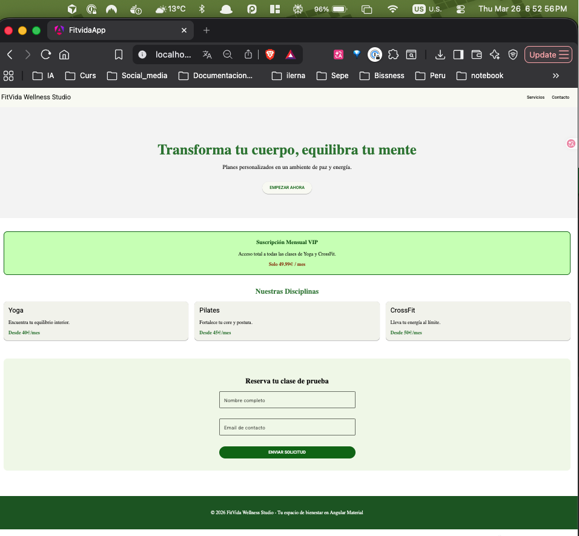

# FitVida Wellness Studio - Angular App

Proyecto desarrollado para la **Práctica 12 de Angular y Material - FitVida Wellness Studio**. 

**Alumno:** Ricardo Luis Avila Bazalar

## Características
- **Angular 21** con componentes Standalone.
- **Angular Material 3** con tema personalizado (Verde #2E7D32 y Naranja #FF8F00).
- **Componentes personalizados** utilizando `@mixin` de Sass para el consumo de temas dinámicos.
- **Diseño Responsive** con CSS Grid y Flexbox.

## Secciones incluidas
1. Toolbar con navegación.
2. Sección Hero con call-to-action.
3. Hero Card personalizada mediante Mixins.
4. Cuadrícula de servicios con Angular Material Cards.
5. Formulario de contacto con validación visual.
6. Footer corporativo.

## Instrucciones para ejecutar el proyecto

1.  **Instalar las dependencias de Node.js:**
    ```bash
    npm install
    ```
2.  **Iniciar con `ng serve`:**
    ```bash
    ng serve
    ```


## Captura de Pantalla

